# Proiect 2 Inteligenta Artificiala - ML Applied

#### Dumitrascu Filip-Teodor 333CA

## Continut
1. [Introducere](#introducere)
2. [EDA](#eda)
3. [Preprocesare Date](#preprocesare-date)
4. [Algoritmi](#algoritmi)
5. [Comparatie](#comparatie)

## Introducere
În activitatea curentă a unui inginer sau cercetător din domeniul inteligenței artificiale, în special al învățării automate, apar frecvent următoarele trei componente esențiale:

- Vizualizarea și analiza exploratorie a datelor (EDA – Exploratory Data Analysis)
- Identificarea și extragerea caracteristicilor relevante ale datelor, utile pentru obiectivul propus (precum clasificare, regresie sau detecția anomaliilor)
- Testarea și compararea mai multor modele, în vederea alegerii celei mai eficiente soluții pentru problema abordată.

Astfel, in acest proiect sunt analizate două seturi de date (Air pollution si News popularity) care sunt parcurse prin etapele menționate anterior, având ca scop aprofundarea înțelegerii procesului de învățare automată.

## EDA
### Air pollution
#### Tipul atributelor
Având în vedere tipul valorilor pe care le conțin și intervalele în care acestea variază, atributele din setul de date pot fi clasificate în următoarele categorii: (se ignora `Unnamed 0`)
- atribute continue: `AQI_Value`, `CO_Value`, `Ozone_Value`, `NO2_Value`, `PM25_Value`, `VOCs`, `SO2` (numerice, valori unice > 20, range de valori > 50)
- atribute discrete: `Country`, `City` (restul care nu sunt continue si ordinale)
- atribute ordinale: `AQI_Category`, `CO_Category`, `Ozone_Category`, `NO2_Category`, `PM25_Category`, `Emissions` (contin obiecte ordonate: Good-Moderate, Level0-Level5)

#### Atribute numerice continue analiza
| Attribute   | Count   | Mean      | Std Dev   | Min     | 25%     | 50%     | 75%     | Max       |
|-------------|---------|-----------|-----------|---------|---------|---------|---------|-----------|
| AQI_Value   | 23463.0 | 72.01     | 56.06     | 6.00    | 39.00   | 55.00   | 79.00   | 500.00    |
| CO_Value    | 23463.0 | 1.37      | 1.83      | 0.00    | 1.00    | 1.00    | 1.00    | 133.00    |
| Ozone_Value | 21117.0 | 35.24     | 28.15     | 0.00    | 21.00   | 31.00   | 40.00   | 222.00    |
| NO2_Value   | 23463.0 | 43.08     | 196.08    | 0.00    | 0.00    | 1.00    | 4.00    | 1003.06   |
| PM25_Value  | 23463.0 | 68.52     | 54.80     | 0.00    | 35.00   | 54.00   | 79.00   | 500.00    |
| VOCs        | 23463.0 | 185.05    | 140.49    | 12.42   | 103.27  | 142.97  | 204.23  | 1280.99   |
| SO2         | 23463.0 | 4.45      | 5.95      | -18.53  | 0.74    | 4.29    | 7.92    | 234.69    |

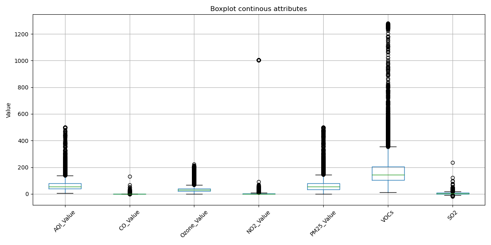

Boxplot-ul evidențiază faptul că majoritatea valorilor pentru atributele continue din setul de date Air Pollution (precum `SO2`, `CO_Value`, `NO2_Value`) sunt concentrate în intervale relativ mici, în timp ce există numeroși outlieri care depășesc cu mult aceste valori. Atributele `VOCs`, `PM25_Value` și `AQI_Value` se remarcă prin plaje mari de valori și un număr ridicat de valori extreme, indicând o distribuție dezechilibrată și posibilă nevoie de tratament al outlierilor.

#### Atribute ordinale analiza

- AQI_Category — Number of examples non-null: 23463
- AQI_Category — Number of unique values: 6
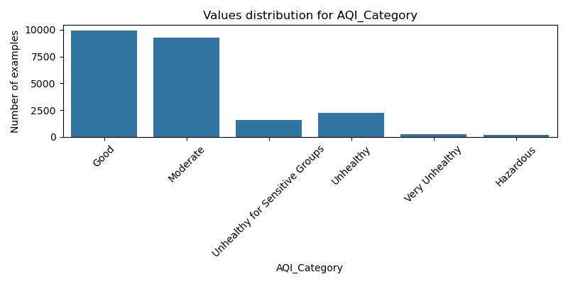
AQI_Category prezintă o distribuție puternic dezechilibrată, cu majoritatea articolelor etichetate drept Good sau Moderate. Clasele Very Unhealthy și Hazardous sunt semnificativ sub-reprezentate.

- CO_Category — Number of examples non-null: 21117
- CO_Category — Number of unique values: 2
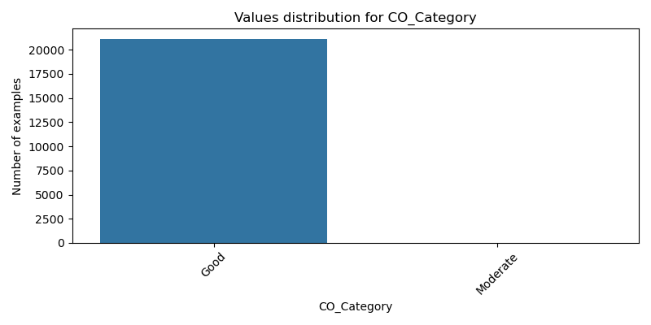

- Ozone_Category — Number of examples non-null: 23463
- Ozone_Category — Number of unique values: 5
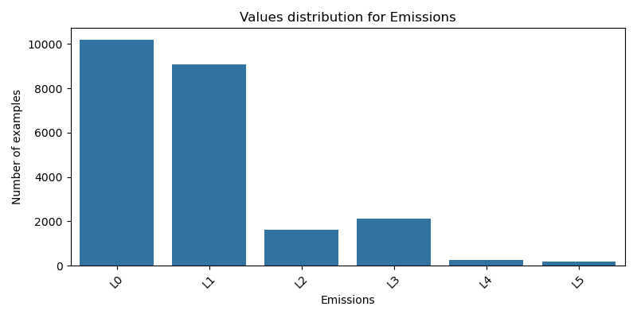

- NO2_Category — Number of examples non-null: 23463
- NO2_Category — Number of unique values: 2
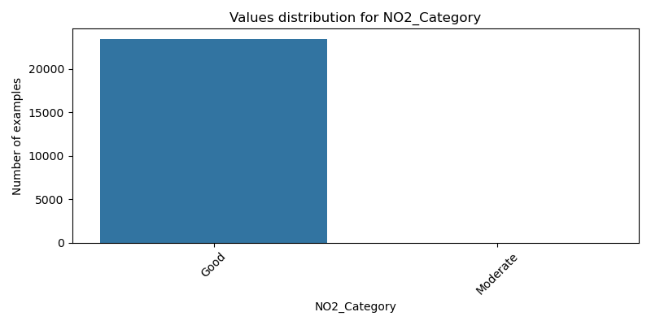
CO_Category, NO2_Category și Ozone_Category sunt dominate de categoria Good, celelalte clase fiind aproape absente. Acest dezechilibru poate afecta performanța algoritmilor de clasificare.

- PM25_Category — Number of examples non-null: 23463
- PM25_Category — Number of unique values: 6
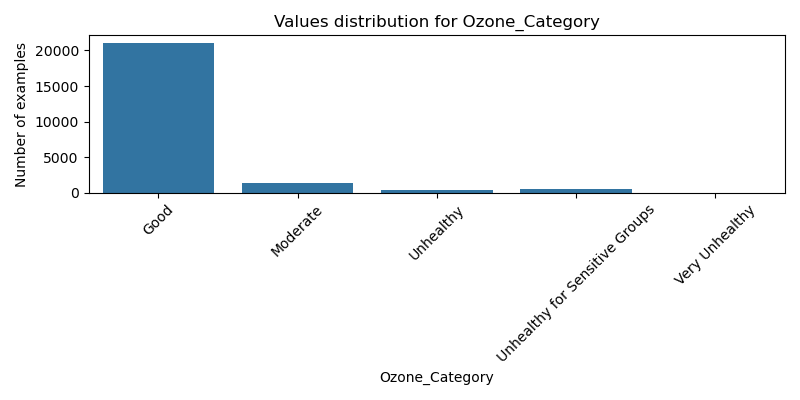

- Emissions — Number of examples non-null: 23463
- Emissions — Number of unique values: 6

Emissions și PM25_Category prezintă o distribuție mai variată, dar tot cu o concentrație ridicată în clasele L0 și L1, indicând un dezechilibru moderat spre sever în cadrul claselor ordinale de tip L.

#### Echilibrul Claselor
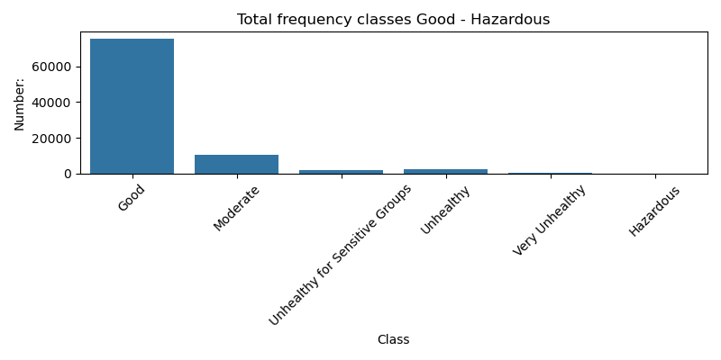

Graficul evidențiază un dezechilibru semnificativ între clasele categoriei AQI. Cea mai mare parte a exemplelor sunt etichetate ca „Good” (peste 70.000), urmată la mare distanță de „Moderate” și apoi de celelalte clase („Unhealthy for Sensitive Groups”, „Unhealthy”, „Very Unhealthy” și „Hazardous”), care sunt subreprezentate. Acest dezechilibru poate afecta performanța algoritmilor de clasificare, care vor înclina spre clasele dominante.

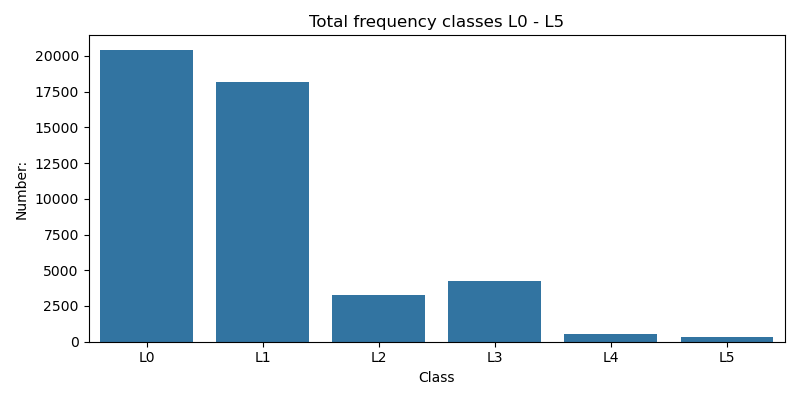

Atributele ordinale legate de nivelul emisiilor (L0–L5) prezintă de asemenea un dezechilibru: clasele L0 și L1 sunt cele mai frecvente, în timp ce L4 și L5 apar rar. Acest tip de distribuție poate influența negativ capacitatea modelului de a învăța să recunoască corect cazurile mai puțin frecvente (niveluri mari de emisii).

#### Corelatia intre atribute

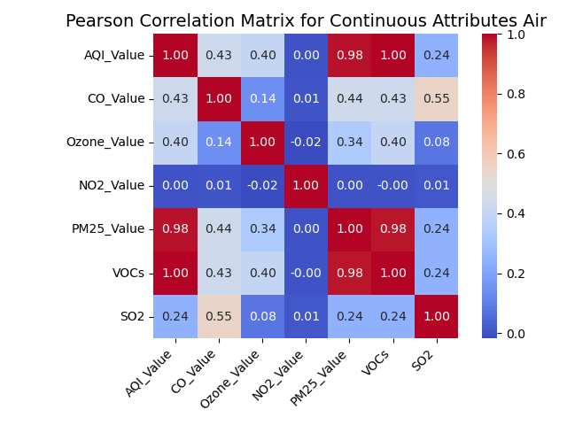

Această matrice evidențiază corelațiile lineare între atributele numerice continue din setul de date Air. Se observă o corelație aproape perfectă (≈1.00) între AQI_Value, PM25_Value și VOCs, indicând redundanță informațională. În schimb, NO2_Value are corelații apropiate de 0 cu toate celelalte atribute, sugerând că este independent din punct de vedere liniar față de restul.

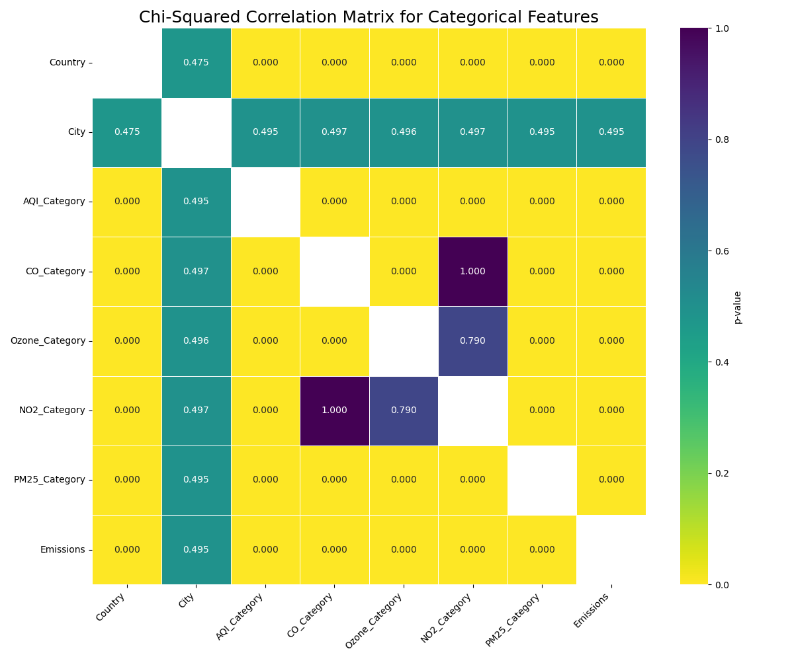

Matricea arată valorile p obținute în urma testului Chi-pătrat aplicat perechilor de variabile categorice. Valori apropiate de 0 indică o asociere statistic semnificativă (corelație), iar valorile mari (ex. CO_Category și NO2_Category) sugerează lipsa de asociere. De exemplu, AQI_Category are legături semnificative cu toate celelalte atribute, ceea ce reflectă importanța sa centrală în evaluarea calității aerului.

### News pollution
#### Tipul atributelor 
Având în vedere tipul valorilor pe care le conțin și intervalele în care acestea variază, atributele din setul de date pot fi clasificate în următoarele categorii: (se ignora `url`)
- atribute continue: ` days_since_published`, ` content_word_count`, ` unique_word_ratio`, ` non_stop_word_ratio`, ` unique_non_stop_ratio`, ` external_links`, ` internal_links`, ` image_count`, ` video_count`, ` keyword_worst_min_shares`, ` keyword_worst_max_shares`, ` keyword_worst_avg_shares`, ` keyword_best_min_shares`, ` keyword_best_max_shares`, ` keyword_best_avg_shares`, ` keyword_avg_min_shares`, ` keyword_avg_max_shares`, ` keyword_avg_avg_shares`, ` ref_min_shares`, ` ref_max_shares`, ` ref_avg_shares`, ` engagement_ratio`, ` content_density` (numerice, valori unice > 20, range de valori > 50)
- atribute discrete: ` title_word_count`, ` avg_word_length`, ` keyword_count`, ` topic_0_relevance`, ` topic_1_relevance`, ` topic_2_relevance`, ` topic_3_relevance`, ` topic_4_relevance`, ` content_subjectivity`, ` content_sentiment`, ` positive_word_rate`, ` negative_word_rate`, ` non_neutral_positive_rate`, ` non_neutral_negative_rate`, ` avg_positive_sentiment`, ` min_positive_sentiment`, ` max_positive_sentiment`, ` avg_negative_sentiment`, ` min_negative_sentiment`, ` max_negative_sentiment`, ` title_subjectivity`, ` title_sentiment`, ` title_subjectivity_magnitude`, ` title_sentiment_magnitude` (numerice, restul)
- atribute ordinale: `popularity_category` (contin obiecte ordonate: Slightly Popular, Moderatately Popular)
- atribute categorice: ` channel_lifestyle`, ` channel_entertainment`, ` channel_business`, ` channel_social_media`, ` channel_tech`, ` channel_world`, ` day_monday`, ` day_tuesday`, ` day_wednesday`, ` day_thursday`, ` day_friday`, ` day_saturday`, ` day_sunday`, ` is_weekend`, ` publication_period` (restul de obiecte)

#### Atribute numerice continue analiza
| Attribute                  | Count     | Mean       | Std Dev   | Min       | 25%       | 50%       | 75%       | Max         |
|----------------------------|-----------|------------|-----------|-----------|-----------|-----------|-----------|-------------|
| days_since_published       | 39644.0   | 354.53     | 214.16    | 8.00      | 164.00    | 339.00    | 542.00    | 731.00      |
| content_word_count         | 39644.0   | 546.51     | 471.11    | 0.00      | 246.00    | 409.00    | 716.00    | 8474.00     |
| unique_word_ratio          | 39644.0   | 0.55       | 3.52      | 0.00      | 0.47      | 0.54      | 0.61      | 701.00      |
| non_stop_word_ratio        | 39644.0   | 1.00       | 5.23      | 0.00      | 1.00      | 1.00      | 1.00      | 1042.00     |
| unique_non_stop_ratio      | 39644.0   | 0.69       | 3.26      | 0.00      | 0.63      | 0.69      | 0.75      | 650.00      |
| external_links             | 39644.0   | 192.25     | 905.42    | 0.00      | 4.00      | 8.00      | 15.00     | 6078.62     |
| internal_links             | 39644.0   | 3.29       | 3.86      | 0.00      | 1.00      | 3.00      | 4.00      | 116.00      |
| image_count                | 39644.0   | 4.54       | 8.31      | 0.00      | 1.00      | 1.00      | 4.00      | 128.00      |
| video_count                | 39644.0   | 1.25       | 4.11      | 0.00      | 0.00      | 0.00      | 1.00      | 91.00       |
| keyword_worst_min_shares   | 39644.0   | 26.11      | 69.63     | -1.00     | -1.00     | -1.00     | 4.00      | 377.00      |
| keyword_worst_max_shares   | 39644.0   | 1153.95    | 3857.99   | 0.00      | 445.00    | 660.00    | 1000.00   | 298400.00   |
| keyword_worst_avg_shares   | 39644.0   | 312.37     | 620.78    | -1.00     | 141.75    | 235.50    | 357.00    | 42827.86    |
| keyword_best_min_shares    | 39644.0   | 13612.35   | 57986.03  | 0.00      | 0.00      | 1400.00   | 7900.00   | 843300.00   |
| keyword_best_max_shares    | 39644.0   | 752324.07  | 214502.13 | 0.00      | 843300.00 | 843300.00 | 843300.00 | 843300.00   |
| keyword_best_avg_shares    | 39644.0   | 259281.94  | 135102.25 | 0.00      | 172846.88 | 244572.22 | 330980.00 | 843300.00   |
| keyword_avg_min_shares     | 39644.0   | 1117.15    | 1137.46   | -1.00     | 0.00      | 1023.64   | 2056.78   | 3613.04     |
| keyword_avg_max_shares     | 39644.0   | 5657.21    | 6098.87   | 0.00      | 3562.10   | 4355.69   | 6019.95   | 298400.00   |
| keyword_avg_avg_shares     | 39644.0   | 3135.86    | 1318.15   | 0.00      | 2382.45   | 2870.07   | 3600.23   | 43567.66    |
| ref_min_shares             | 39644.0   | 3998.76    | 19738.67  | 0.00      | 639.00    | 1200.00   | 2600.00   | 843300.00   |
| ref_max_shares             | 39644.0   | 10329.21   | 41027.58  | 0.00      | 1100.00   | 2800.00   | 8000.00   | 843300.00   |
| ref_avg_shares             | 39644.0   | 6401.70    | 24211.33  | 0.00      | 981.19    | 2200.00   | 5200.00   | 843300.00   |
| engagement_ratio           | 39644.0   | 1054.07    | 3496.61   | 0.04      | 220.00    | 465.50    | 900.00    | 221200.00   |
| content_density            | 35680.0   | 1986.56    | 2209.10   | 32.76     | 746.07    | 1314.55   | 2506.71   | 58857.97    |

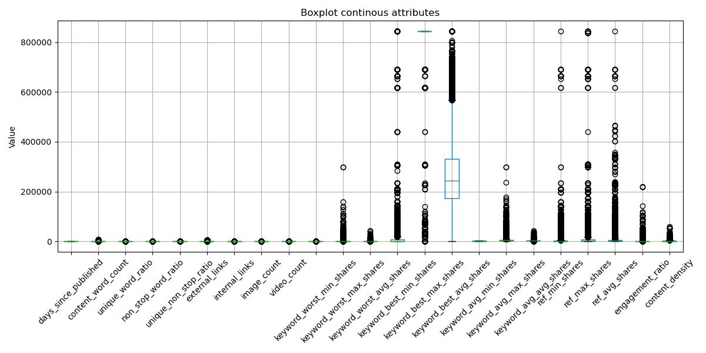

Boxplot-ul pentru setul News Popularity arată o variabilitate mare între atribute, unele dintre ele având valori extrem de ridicate (peste 800.000), precum `keyword_best_max_shares` sau `ref_max_shares`. Multe dintre atribute sunt puternic dezechilibrate, cu mediane joase și prezența unor outlieri extremi. Acest lucru sugerează că este necesară o etapă de tratare a valorilor extreme și o eventuală standardizare a datelor pentru a evita influențarea algoritmilor de ML.

#### Atribute ordinale/catgorice analiza

- channel_business — Number of non-null examples: 39644
- channel_business — Number of unique values: 2

- channel_entertainment — Number of non-null examples: 39644
- channel_entertainment — Number of unique values: 2

- channel_lifestyle — Number of non-null examples: 35680
- channel_lifestyle — Number of unique values: 2

- channel_social_media — Number of non-null examples: 39644
- channel_social_media — Number of unique values: 2

- channel_tech — Number of non-null examples: 39644
- channel_tech — Number of unique values: 2

- channel_world — Number of non-null examples: 39644
- channel_world — Number of unique values: 2

Atributele binare precum channel_business, channel_entertainment, channel_lifestyle, channel_social_media, channel_tech, channel_world arată dacă un articol aparține unui anumit canal tematic. Distribuția este dezechilibrată în toate cazurile: predomină valorile 'N' (nu aparține canalului), iar doar o fracțiune relativ mică sunt articole marcate cu 'Y' (da). Acest lucru poate influența performanța clasificatorilor, deoarece modelul învață mai greu din clasele rare.

- day_monday — Number of non-null examples: 39644
- day_monday — Number of unique values: 2

- day_tuesday — Number of non-null examples: 39644
- day_tuesday — Number of unique values: 2

- day_wednesday — Number of non-null examples: 39644
- day_wednesday — Number of unique values: 2

- day_thursday — Number of non-null examples: 39644
- day_thursday — Number of unique values: 2

- day_friday — Number of non-null examples: 39644
- day_friday — Number of unique values: 2

- day_saturday — Number of non-null examples: 39644
- day_saturday — Number of unique values: 2

- day_sunday — Number of non-null examples: 39644
- day_sunday — Number of unique values: 2

- is_weekend — Number of non-null examples: 39644
- is_weekend — Number of unique values: 2

Atributele binare de tipul day_monday, day_friday, day_saturday etc. indică dacă articolul a fost publicat într-o anumită zi. Distribuția este tot dezechilibrată — majoritatea valorilor sunt 'N', în timp ce 'Y' apare doar când articolul a fost publicat în acea zi. Se observă o ușoară variație între zilele săptămânii și weekend.

- publication_period — Number of non-null examples: 39644
- publication_period — Number of unique values: 2

Majoritatea articolelor sunt publicate în timpul săptămânii (Weekday), cu o proporție mai mică în Weekend.

- popularity_category — Number of non-null examples: 39644
- popularity_category — Number of unique values: 5
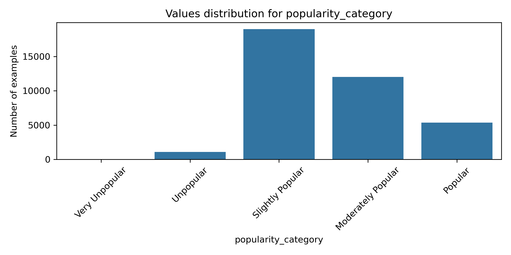

Cea mai frecventă clasă este Slightly Popular, urmată de Moderately Popular. Clasele extreme, precum Very Unpopular, sunt rare, ceea ce sugerează o etichetare dezechilibrată și potențială dificultate în clasificare.

#### Echilibrul Claselor
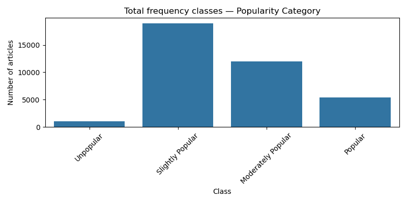

Graficul arată un dezechilibru semnificativ între clase: cele mai multe articole sunt etichetate ca Slightly Popular și Moderately Popular, în timp ce clasele extreme (Very Unpopular, Popular) sunt subreprezentate. Acest dezechilibru poate afecta algoritmii de clasificare, care tind să favorizeze clasele dominante.

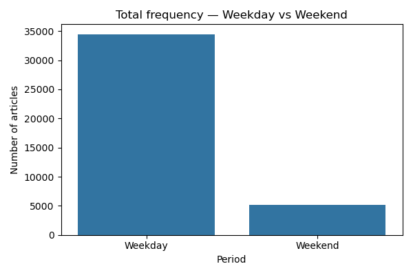

Majoritatea articolelor sunt publicate în timpul săptămânii (Weekday), ceea ce reflectă o practică obișnuită în media online. Articolele din Weekend reprezintă un procent mult mai mic, sugerând un potențial efect de sezon sau comportament diferit al publicului.

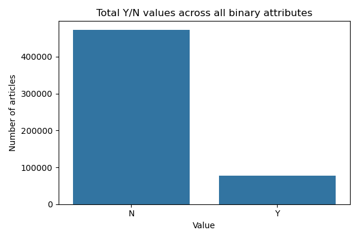

Distribuția totală a valorilor Y și N pentru toate coloanele binare (precum channel_*, day_*) este profund dezechilibrată în favoarea valorii N. Asta indică faptul că articolele aparțin rar unui canal sau unei zile anume. Acest dezechilibru trebuie tratat cu atenție în modelele de clasificare (ex. prin ponderare sau sampling).

#### Corelatia intre atribute

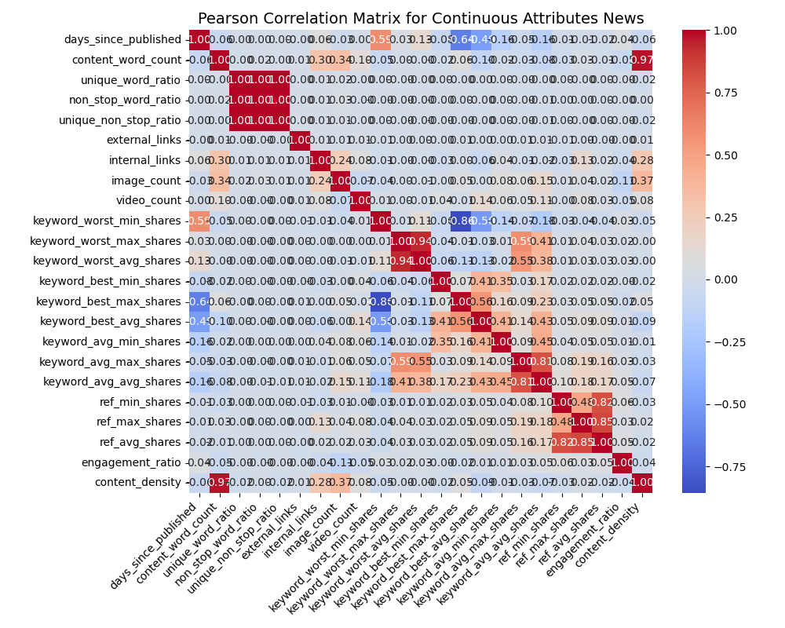
Această matrice arată corelațiile Pearson între atributele numerice continue. Se observă corelații foarte puternice între:
`content_word_count` și `content_density` (0.97) – articolele mai lungi tind să aibă o densitate de conținut mai mare.
Variabilele privind partajările (shares) ale cuvintelor cheie (keyword_*) sunt corelate pozitiv între ele (valori între 0.4 și 0.8).
`ref_avg_shares` și `ref_max_shares` sau `ref_min_shares` sunt, de asemenea, corelate moderat spre puternic.
În general, există grupuri clare de variabile corelate, utile pentru reducerea dimensionalității sau selecția atributelor.

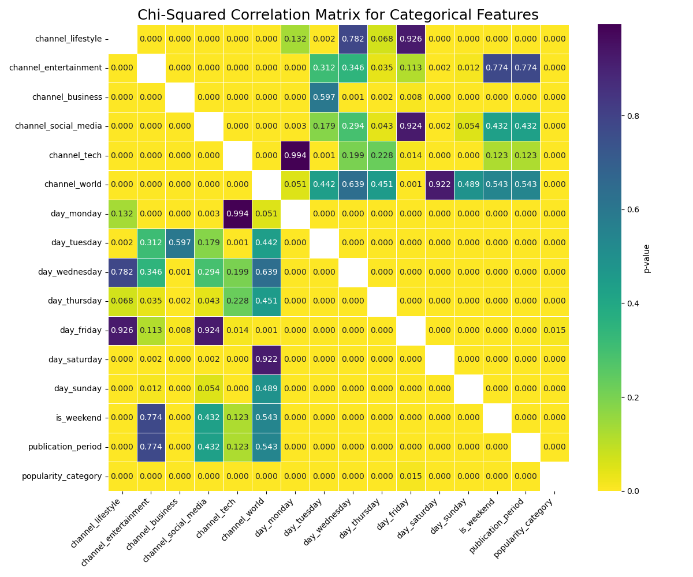
Această matrice exprimă semnificația statistică a relației dintre atributele categorice (inclusiv cele ordinale), folosind testul Chi-pătrat (p-value).
Valorile apropiate de 0 (culoare galbenă intensă) indică o relație semnificativă statistic între variabile.
Se observă corelații puternice între:
Zilele săptămânii (`day_monday`, `day_tuesday`, etc.) și `is_weekend` sau `publication_period`.
Canalele (`channel_*`) și `publication_period`, sugerând că unele tipuri de conținut sunt mai frecvente în anumite perioade.
`popularity_category` este semnificativ asociat cu majoritatea celorlalte variabile categorice, sugerând că popularitatea articolelor este influențată de mulți factori discreți.

## Preprocesare Date
### Air pollution data set

#### Atribute cu date lipsa si imputarea lor
Atributes with missing values:
CO_Category    1893
Ozone_Value    1870
Country         349

After imputation, missing values in train:
CO_Category    0
Ozone_Value    0
Country        0

#### Valorile extreme si inlocuirea acestora cu cele din imputare
[Train] AQI_Value: 2354 outliers replaced with NaN
[Train] CO_Value: 6858 outliers replaced with NaN
[Train] Ozone_Value: 1219 outliers replaced with NaN
[Train] NO2_Value: 2038 outliers replaced with NaN
[Train] PM25_Value: 2160 outliers replaced with NaN
[Train] VOCs: 2331 outliers replaced with NaN
[Train] SO2: 240 outliers replaced with NaN

Replacing outliers with NaN in airDataTest using train IQR...
[Test] AQI_Value: 581 outliers replaced with NaN
[Test] CO_Value: 1738 outliers replaced with NaN
[Test] Ozone_Value: 284 outliers replaced with NaN
[Test] NO2_Value: 516 outliers replaced with NaN
[Test] PM25_Value: 547 outliers replaced with NaN
[Test] VOCs: 576 outliers replaced with NaN
[Test] SO2: 56 outliers replaced with NaN

Outliers replaced with NaN and imputed with column mean.

#### Variabile redundante
Removed redundant features: ['VOCs', 'PM25_Value', 'CO_Category', 'Ozone_Category', 'NO2_Category', 'PM25_Category', 'Emissions', 'City', 'Country']

#### Standardizare
Pentru ca Regresia Logistica sa functioneze se standardizeaza valorile atributelor numerice

### News pollution data set

#### Atribute cu date lipsa si imputarea lor
Atributes with missing values:
channel_lifestyle    3175
content_density      3145

After imputation, missing values in train:
channel_lifestyle    0
content_density      0

#### Valorile extreme si inlocuirea acestora cu cele din imputare
[Train]  days_since_published: 0 outliers replaced with NaN
[Train]  title_word_count: 123 outliers replaced with NaN
[Train]  content_word_count: 1539 outliers replaced with NaN
[Train]  unique_word_ratio: 1290 outliers replaced with NaN
[Train]  non_stop_word_ratio: 2234 outliers replaced with NaN
[Train]  unique_non_stop_ratio: 1393 outliers replaced with NaN
[Train]  external_links: 2665 outliers replaced with NaN
[Train]  internal_links: 1674 outliers replaced with NaN
[Train]  image_count: 6159 outliers replaced with NaN
[Train]  video_count: 2330 outliers replaced with NaN
[Train]  avg_word_length: 1363 outliers replaced with NaN
[Train]  keyword_count: 47 outliers replaced with NaN
[Train]  keyword_worst_min_shares: 3743 outliers replaced with NaN
[Train]  keyword_worst_max_shares: 2939 outliers replaced with NaN
[Train]  keyword_worst_avg_shares: 1694 outliers replaced with NaN
[Train]  keyword_best_min_shares: 4025 outliers replaced with NaN
[Train]  keyword_best_max_shares: 7542 outliers replaced with NaN
[Train]  keyword_best_avg_shares: 791 outliers replaced with NaN
[Train]  keyword_avg_min_shares: 0 outliers replaced with NaN
[Train]  keyword_avg_max_shares: 1893 outliers replaced with NaN
[Train]  keyword_avg_avg_shares: 1284 outliers replaced with NaN
[Train]  ref_min_shares: 3979 outliers replaced with NaN
[Train]  ref_max_shares: 3450 outliers replaced with NaN
[Train]  ref_avg_shares: 3362 outliers replaced with NaN
[Train]  topic_0_relevance: 4238 outliers replaced with NaN
[Train]  topic_1_relevance: 4624 outliers replaced with NaN
[Train]  topic_2_relevance: 2864 outliers replaced with NaN
[Train]  topic_3_relevance: 211 outliers replaced with NaN
[Train]  topic_4_relevance: 0 outliers replaced with NaN
[Train]  content_subjectivity: 1551 outliers replaced with NaN
[Train]  content_sentiment: 682 outliers replaced with NaN
[Train]  positive_word_rate: 415 outliers replaced with NaN
[Train]  negative_word_rate: 1052 outliers replaced with NaN
[Train]  non_neutral_positive_rate: 1289 outliers replaced with NaN
[Train]  non_neutral_negative_rate: 390 outliers replaced with NaN
[Train]  avg_positive_sentiment: 1701 outliers replaced with NaN
[Train]  min_positive_sentiment: 2527 outliers replaced with NaN
[Train]  max_positive_sentiment: 0 outliers replaced with NaN
[Train]  avg_negative_sentiment: 704 outliers replaced with NaN
[Train]  min_negative_sentiment: 0 outliers replaced with NaN
[Train]  max_negative_sentiment: 1987 outliers replaced with NaN
[Train]  title_subjectivity: 0 outliers replaced with NaN
[Train]  title_sentiment: 6319 outliers replaced with NaN
[Train]  title_subjectivity_magnitude: 0 outliers replaced with NaN
[Train]  title_sentiment_magnitude: 1343 outliers replaced with NaN
[Train]  engagement_ratio: 3225 outliers replaced with NaN
[Train]  content_density: 2355 outliers replaced with NaN

Replacing outliers with NaN in newsDataTrain using train IQR...
[Test]  days_since_published: 0 outliers replaced with NaN
[Test]  title_word_count: 0 outliers replaced with NaN
[Test]  content_word_count: 0 outliers replaced with NaN
[Test]  unique_word_ratio: 0 outliers replaced with NaN
[Test]  non_stop_word_ratio: 0 outliers replaced with NaN
[Test]  unique_non_stop_ratio: 0 outliers replaced with NaN
[Test]  external_links: 0 outliers replaced with NaN
[Test]  internal_links: 0 outliers replaced with NaN
[Test]  image_count: 0 outliers replaced with NaN
[Test]  video_count: 0 outliers replaced with NaN
[Test]  avg_word_length: 0 outliers replaced with NaN
[Test]  keyword_count: 0 outliers replaced with NaN
[Test]  keyword_worst_min_shares: 0 outliers replaced with NaN
[Test]  keyword_worst_max_shares: 0 outliers replaced with NaN
[Test]  keyword_worst_avg_shares: 0 outliers replaced with NaN
[Test]  keyword_best_min_shares: 0 outliers replaced with NaN
[Test]  keyword_best_max_shares: 0 outliers replaced with NaN
[Test]  keyword_best_avg_shares: 0 outliers replaced with NaN
[Test]  keyword_avg_min_shares: 0 outliers replaced with NaN
[Test]  keyword_avg_max_shares: 0 outliers replaced with NaN
[Test]  keyword_avg_avg_shares: 0 outliers replaced with NaN
[Test]  ref_min_shares: 0 outliers replaced with NaN
[Test]  ref_max_shares: 0 outliers replaced with NaN
[Test]  ref_avg_shares: 0 outliers replaced with NaN
[Test]  topic_0_relevance: 0 outliers replaced with NaN
[Test]  topic_1_relevance: 0 outliers replaced with NaN
[Test]  topic_2_relevance: 0 outliers replaced with NaN
[Test]  topic_3_relevance: 0 outliers replaced with NaN
[Test]  topic_4_relevance: 0 outliers replaced with NaN
[Test]  content_subjectivity: 0 outliers replaced with NaN
[Test]  content_sentiment: 0 outliers replaced with NaN
[Test]  positive_word_rate: 0 outliers replaced with NaN
[Test]  negative_word_rate: 0 outliers replaced with NaN
[Test]  non_neutral_positive_rate: 0 outliers replaced with NaN
[Test]  non_neutral_negative_rate: 0 outliers replaced with NaN
[Test]  avg_positive_sentiment: 0 outliers replaced with NaN
[Test]  min_positive_sentiment: 0 outliers replaced with NaN
[Test]  max_positive_sentiment: 0 outliers replaced with NaN
[Test]  avg_negative_sentiment: 0 outliers replaced with NaN
[Test]  min_negative_sentiment: 0 outliers replaced with NaN
[Test]  max_negative_sentiment: 0 outliers replaced with NaN
[Test]  title_subjectivity: 0 outliers replaced with NaN
[Test]  title_sentiment: 0 outliers replaced with NaN
[Test]  title_subjectivity_magnitude: 0 outliers replaced with NaN
[Test]  title_sentiment_magnitude: 0 outliers replaced with NaN
[Test]  engagement_ratio: 0 outliers replaced with NaN
[Test]  content_density: 0 outliers replaced with NaN

Outliers replaced with NaN and imputed with column mean.

#### Variabile redundante
Removed redundant features: ['content_density', 'non_stop_word_ratio', 'unique_non_stop_ratio', 'keyword_best_avg_shares', 'keyword_avg_avg_shares', 'ref_avg_shares', 'publication_period', 'is_weekend', 'channel_business', 'channel_entertainment', 'channel_lifestyle', 'channel_social_media', 'channel_tech', 'channel_world', 'day_monday', 'day_tuesday', 'day_wednesday', 'day_thursday', 'day_friday', 'day_saturday', 'day_sunday']

#### Standardizare
Pentru ca Regresia Logistica sa functioneze se standardizeaza valorile atributelor numerice

## Algoritmi
### Air pollution data set
#### Arbori de decizie

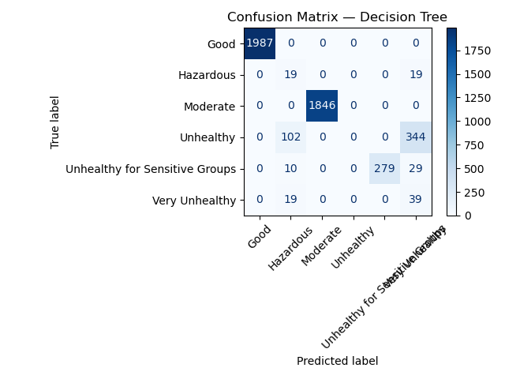

Classification Report — Decision Tree
| Class                             | Precision | Recall | F1-score | Support |
|----------------------------------|-----------|--------|----------|---------|
| Good                             | 1.00      | 1.00   | 1.00     | 1987    |
| Hazardous                        | 0.13      | 0.50   | 0.20     | 38      |
| Moderate                         | 1.00      | 1.00   | 1.00     | 1846    |
| Unhealthy                        | 0.00      | 0.00   | 0.00     | 446     |
| Unhealthy for Sensitive Groups   | 1.00      | 0.88   | 0.93     | 318     |
| Very Unhealthy                   | 0.09      | 0.67   | 0.16     | 58      |
|                                  |           |        |          |         |
| **Accuracy**                     |           |        | **0.89** | 4693    |
| **Macro Avg**                    | 0.54      | 0.67   | 0.55     | 4693    |
| **Weighted Avg**                 | 0.89      | 0.89   | 0.88     | 4693    |
Accuracy (Decision Tree): 0.8886

Un model de arbore de decizie folosind biblioteca scikit-learn, cu scopul de a prezice categoria calității aerului (AQI_Category).
Modelul a fost antrenat pe setul de date procesat (X_train, y_train), cu următorii hiperparametri:
- Criteriu: entropy — pentru a maximiza informația câștigată la fiecare split
- Adâncime maximă (max_depth): 4 — pentru a evita suprapotrivirea
- Număr minim de exemple într-o frunză (min_samples_leaf): 5 — pentru a evita frunze rare
- Ponderare a claselor (class_weight): balanced — pentru a contracara distribuția dezechilibrată a claselor

Deși modelul obține o acuratețe generală ridicată (88.86%), scorurile de precizie și recall pentru clasele subreprezentate (ex. „Hazardous”, „Unhealthy”) sunt foarte mici. Aceasta indică faptul că modelul tinde să favorizeze clasele frecvente, fiind ineficient în identificarea corectă a celor rare. Într-un context real, acest lucru poate fi problematic dacă aceste clase reprezintă condiții critice.

#### Paduri Aleatoare

| Class                            | Precision | Recall | F1-score | Support |
|----------------------------------|-----------|--------|----------|---------|
| Good                             | 1.00      | 1.00   | 1.00     | 1987    |
| Hazardous                        | 0.08      | 0.71   | 0.14     | 38      |
| Moderate                         | 0.98      | 0.94   | 0.96     | 1846    |
| Unhealthy                        | 0.87      | 0.26   | 0.40     | 446     |
| Unhealthy for Sensitive Groups   | 1.00      | 0.88   | 0.93     | 318     |
| Very Unhealthy                   | 0.12      | 0.36   | 0.19     | 58      |
|                                  |           |        |          |         |
| **Accuracy**                     |           |        | **0.89** | 4693    |
| **Macro Avg**                    | 0.67      | 0.69   | 0.60     | 4693    |
| **Weighted Avg**                 | 0.96      | 0.89   | 0.91     | 4693    |
Accuracy (Random Forest): 0.8881

Un model Random Forest a fost antrenat folosind biblioteca scikit-learn pentru a prezice categoria calității aerului (AQI_Category). Modelul a fost antrenat pe datele procesate (X_train, y_train) și a utilizat următorii hiperparametri:

- Criteriu: entropy — maximizează câștigul informațional la fiecare split;
- Adâncime maximă (max_depth): 4 — limitează complexitatea fiecărui arbore pentru a preveni suprapotrivirea;
- Număr minim de exemple într-o frunză (min_samples_leaf): 5 — previne formarea frunzelor cu puține instanțe;
- Ponderare a claselor (class_weight): balanced — ajustează automat greutățile în funcție de distribuția claselor, fiind util pentru seturi dezechilibrate;
- Număr de estimatori (n_estimators): 100 — utilizează 100 de arbori de decizie individuali;
- Proporție de eșantion pentru fiecare estimator: implicită (bootstrap=True) — fiecare arbore este antrenat pe un subset bootstrap diferit al datelor;
- Proporție de atribute utilizate de fiecare arbore: implicită (max_features='sqrt') — fiecare arbore selectează aleator √n atribute la fiecare split, ceea ce ajută la reducerea corelației dintre arbori și îmbunătățirea generalizării.

Modelul obține o acuratețe globală de 88.9%, dar performanța pe clasele dezechilibrate rămâne limitată. De exemplu, pentru clasa „Hazardous”, modelul are un scor de recall de 71%, dar precizia este doar 8%, indicând un număr ridicat de fals pozitive. De asemenea, clase precum „Unhealthy” sau „Very Unhealthy” au dificultăți în a fi clasificate corect.Această situație sugerează că, deși Random Forest îmbunătățește ușor performanțele față de arborele de decizie simplu, provocările legate de dezechilibrul claselor persistă. În aplicații critice (ex. poluare extremă), aceste limitări pot afecta capacitatea sistemului de a reacționa adecvat la condiții periculoase.

#### Regresie Logistica

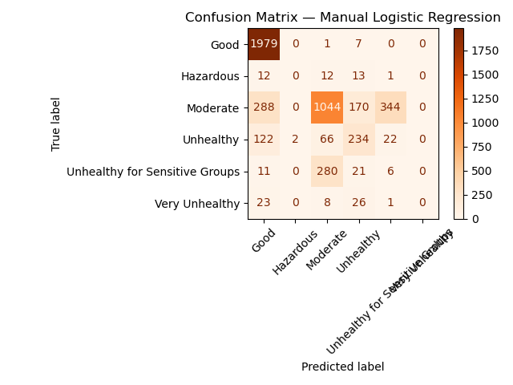

| Class                                | Precision | Recall | F1-score | Support |
|--------------------------------------|-----------|--------|----------|---------|
| Good                                 | 0.81      | 1.00   | 0.90     | 1987    |
| Hazardous                            | 0.00      | 0.00   | 0.00     | 38      |
| Moderate                             | 0.74      | 0.57   | 0.64     | 1846    |
| Unhealthy                            | 0.50      | 0.52   | 0.51     | 446     |
| Unhealthy for Sensitive Groups       | 0.02      | 0.02   | 0.02     | 318     |
| Very Unhealthy                       | 0.00      | 0.00   | 0.00     | 58      |
|                                      |           |        |          |         |
| **Accuracy**                         |           |        | **0.70** | 4693    |
| **Macro Avg**                        | 0.34      | 0.35   |  0.34    | 4693    |
| **Weighted Avg**                     | 0.68      | 0.70   |  0.68    | 4693    |

Accuracy (Logistic Regression): 0.6953

Un model de regresie logistică a fost implementat manual și antrenat pentru a clasifica calitatea aerului (AQI_Category) folosind un optimizator de tip gradient descent. Acest model a fost testat pe un set de date cu mai multe clase, inclusiv „Good”, „Moderate”, „Unhealthy” și „Hazardous”. Pentru preprocesarea datelor:
- Atributele categorice au fost transformate folosind One-Hot Encoding, aplicat exclusiv pe coloanele cu cardinalitate redusă (prin ColumnTransformer).
- Atributele numerice au fost păstrate nemodificate (remainder='passthrough').
Algoritmul de optimizare a utilizat:
- Gradient Descent full-batch
- Learning rate: 0.1
- Număr epoci: 3000
- Inițializare greutăți: distribuție normală (N(0,1))
- Regularizare: L2 (cu λ = 0.01) pentru a penaliza coeficienții mari și a reduce overfitting-ul
Modelul a obținut o acuratețe globală de 69.5%, ceea ce indică un rezultat rezonabil pentru un model liniar aplicat pe un set dezechilibrat.
Cu toate acestea, performanța per clasă evidențiază limitele:
- Clasa „Good” este clasificată excelent (recall 100%, f1-score 0.90)
- Clasele „Very Unhealthy” și „Hazardous” nu sunt identificate corect (precizie și recall 0), din cauza dezechilibrului și a numărului redus de exemple
Această distribuție sugerează că regresia logistică are dificultăți în a separa corect clasele mai rare sau care se suprapun în spațiul atributelor. Pentru aplicații critice de mediu, acest lucru limitează utilitatea modelului fără metode suplimentare de balansare.

#### MLP

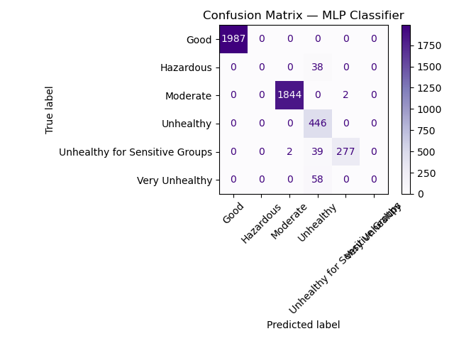

| Class                             | Precision | Recall | F1-score | Support |
|----------------------------------|-----------|--------|----------|---------|
| Good                             | 1.00      | 1.00   | 1.00     | 1987    |
| Hazardous                        | 0.00      | 0.00   | 0.00     | 38      |
| Moderate                         | 0.99      | 0.98   | 0.98     | 1846    |
| Unhealthy                        | 0.72      | 0.99   | 0.83     | 446     |
| Unhealthy for Sensitive Groups   | 1.00      | 0.84   | 0.91     | 318     |
| Very Unhealthy                   | 0.00      | 0.00   | 0.00     | 58      |
|                                  |           |        |          |         |
| **Accuracy**                     |           |        | **0.96** | 4693    |
| **Macro Avg**                    | 0.62      | 0.63   | 0.62     | 4693    |
| **Weighted Avg**                 | 0.95      | 0.96   | 0.95     | 4693    |
Accuracy (MLP): 0.9593

Un model de rețea neurală de tip MLP (Multi-Layer Perceptron) a fost antrenat pentru a prezice clasa de calitate a aerului (AQI_Category). Modelul a fost antrenat pe setul de date procesat cu următorii hiperparametri:
- Arhitectură: un singur strat ascuns cu 100 de neuroni
- Funcția de activare: ReLU

- Optimizator: Adam
- Learning rate: 0.001
- Număr maxim de epoci: 200

- Criteriu de oprire timpurie (early_stopping=True) pentru prevenirea suprapotrivirii
- Coeficient de regularizare: alpha=0.0001

Modelul a atins o acuratețe globală ridicată de 95.93%, dar performanța este puternic dezechilibrată între clase:
- Clasele majore precum Good, Moderate sau Unhealthy for Sensitive Groups sunt clasificate corect în proporție foarte mare.
- Clasele rare precum Hazardous și Very Unhealthy au precizie și recall 0, ceea ce înseamnă că modelul nu le identifică deloc corect.
- Clasa Unhealthy are un recall foarte bun (0.99), dar o precizie scăzută (0.72), ceea ce indică existența multor fals pozitive.

Modelul este eficient în identificarea claselor frecvente, dar insuficient pentru aplicații critice unde recunoașterea corectă a stărilor periculoase (ex. Hazardous) este esențială.

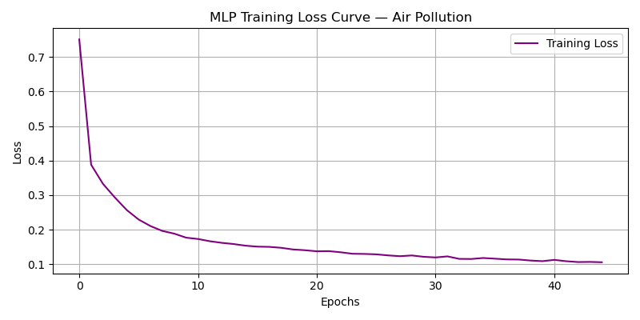

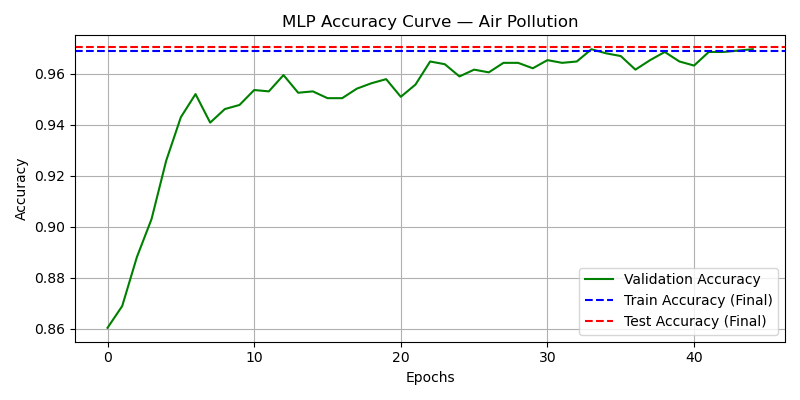

### News pollution data set
#### Arbori de decizie

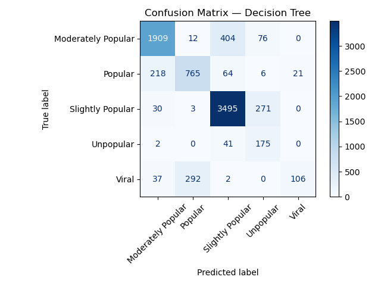

| Class                | Precision | Recall | F1-score | Support |
|---------------------|-----------|--------|----------|---------|
| Moderately Popular  | 0.87      | 0.80   | 0.83     | 2401    |
| Popular             | 0.71      | 0.71   | 0.71     | 1074    |
| Slightly Popular    | 0.87      | 0.92   | 0.90     | 3799    |
| Unpopular           | 0.33      | 0.80   | 0.47     | 218     |
| Viral               | 0.84      | 0.24   | 0.37     | 437     |
|                     |           |        |          |         |
| **Accuracy**        |           |        | **0.8135** | 7929    |
| **Macro avg**       | 0.73      | 0.69   | 0.66     | 7929    |
| **Weighted avg**    | 0.83      | 0.81   | 0.81     | 7929    |

Modelul de arbore de decizie antrenat pentru clasificarea popularității știrilor a atins o acuratețe generală de 81.35%, un scor foarte bun având în vedere numărul de clase și natura dezechilibrată a setului de date.
- Clasele „Slightly Popular”, „Moderately Popular” și „Popular” sunt bine clasificate, cu f1-scores de peste 0.70 și recall ridicat.
- Clasa „Unpopular”, deși are un număr mic de exemple, este surprinzător de bine captată (recall 0.80), dar cu precizie slabă (0.33), ceea ce indică multe false positive.
- Clasa „Viral” este mai dificil de identificat: are o precizie bună (0.84), dar un recall foarte mic (0.24), ceea ce sugerează că modelul tinde să fie conservator și să nu clasifice decât foarte puține articole drept virale — ceea ce poate fi acceptabil dacă se dorește evitarea alarmelor false.
Modelul a fost antrenat cu hiperparametri aleși atent:
- max_depth=20 pentru flexibilitate crescută,
- min_samples_leaf=2 pentru a reduce overfitting,
- class_weight='balanced' pentru a trata dezechilibrul dintre clase.

Astfel, modelul oferă o performanță solidă și este potrivit ca soluție de bază pentru predicția popularității știrilor. Clasele extreme, cum ar fi „Viral” sau „Unpopular”, pot fi îmbunătățite suplimentar prin oversampling, ensemble methods sau modele mai complexe precum Random Forest sau MLP.

#### Paduri Aleatoare

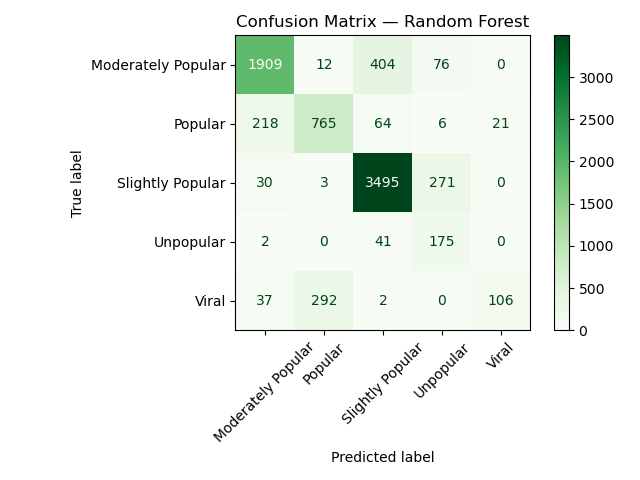

| Class                | Precision | Recall | F1-score | Support |
|---------------------|-----------|--------|----------|---------|
| Moderately Popular  | 0.87      | 0.80   | 0.83     | 2401    |
| Popular             | 0.71      | 0.71   | 0.71     | 1074    |
| Slightly Popular    | 0.87      | 0.92   | 0.90     | 3799    |
| Unpopular           | 0.33      | 0.80   | 0.47     | 218     |
| Viral               | 0.84      | 0.24   | 0.37     | 437     |
|                     |           |        |          |         |
| **Accuracy**        |           |        | **0.8135** | 7929    |
| **Macro avg**       | 0.73      | 0.69   | 0.66     | 7929    |
| **Weighted avg**    | 0.83      | 0.81   | 0.81     | 7929    |
Accuracy (Random Forest): 0.8135

Modelul Random Forest a obținut o acuratețe generală de 81.35% în clasificarea popularității articolelor de știri, oferind rezultate aproape identice cu arborele de decizie individual, dar cu un plus de robustețe și stabilitate.
- Performanța este foarte bună pentru clasele „Slightly Popular”, „Moderately Popular” și „Popular”, care reprezintă majoritatea setului. Acestea au f1-score-uri de peste 0.70 și un recall foarte ridicat.
- Clasa „Unpopular” este captată bine în recall (0.80), dar suferă la precizie (0.33), ceea ce sugerează un număr mare de clasificări false pozitive.
- Clasa „Viral” are din nou dificultăți de identificare, cu un recall de doar 0.24, deși precizia este bună (0.84), similar cu Decision Tree.

Modelul a fost antrenat cu următorii hiperparametri:
- n_estimators=100: o pădure de 100 de arbori,
- max_depth=20: pentru a permite învățarea relațiilor complexe,
- min_samples_leaf=2: pentru a reduce overfitting-ul pe frunze mici,
- criterion='entropy': pentru a maximiza câștigul informațional,- class_weight='balanced': pentru a contrabalansa distribuția inegală a claselor.

Astfel, Random Forest este un model solid pentru această sarcină, oferind un echilibru foarte bun între precizie și generalizare. Pentru clasele subreprezentate, performanța poate fi îmbunătățită prin tehnici de oversampling, creșterea numărului de estimatori sau ajustarea ponderii claselor.

#### Regresie Logistica

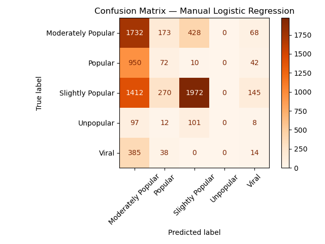

| Class                  | Precision | Recall | F1-score | Support |
|------------------------|-----------|--------|----------|---------|
| Moderately Popular     | 0.38      | 0.72   | 0.50     | 2401    |
| Popular                | 0.13      | 0.07   | 0.09     | 1074    |
| Slightly Popular       | 0.78      | 0.52   | 0.63     | 3799    |
| Unpopular              | 0.00      | 0.00   | 0.00     | 218     |
| Viral                  | 0.05      | 0.03   | 0.04     | 437     |
|                        |           |        |          |         |
| **Accuracy**           |           |        | **0.48** | 7929    |
| **Macro Avg**          | 0.27      | 0.27   |  0.25    | 7929    |
| **Weighted Avg**       | 0.51      | 0.48   | 0.46     | 7929    |

Accuracy (Manual Logistic Regression): 0.4777

Pentru problema clasificării popularității știrilor, a fost implementat un model de regresie logistică multi-clasă, folosind o strategie One-vs-Rest (OvR). Aceasta presupune antrenarea câte unui model logistic binar pentru fiecare clasă posibilă, modelând fiecare „vs restul”.
Encodare: Atributele categorice au fost prelucrate prin One-Hot Encoding (doar pentru cele cu cardinalitate redusă), folosind ColumnTransformer. Atributele numerice au fost păstrate nealterate.
Optimizare:
- Algoritm: Gradient Descent standard
- Learning rate: 0.1
- Număr epoci: 3000
- Regularizare L2: λ = 0.01
Fiecare model binar din OvR a fost antrenat independent, iar la inferență, scorurile de probabilitate pentru fiecare clasă au fost comparate pentru a alege predicția finală.
Modelul a obținut o acuratețe globală de 47.7%, semnificativ mai bună decât o clasificare aleatorie, dar cu performanțe neuniforme:
- Clasele „Moderately Popular” și „Slightly Popular” sunt cele mai bine clasificate (recall 72% și 52%)
- Clasele „Popular” și „Viral” sunt adesea confundate cu clasele dominante
- Clasa „Unpopular” are precizie și recall aproape 0, sugerând confuzie sistematică cu clasele apropiate

Distribuția rezultatelor sugerează că, deși OvR permite aplicarea regresiei logistice la clasificare multi-clasă, separabilitatea liniară limitată și dezechilibrul între clase afectează puternic performanța.

#### MLP

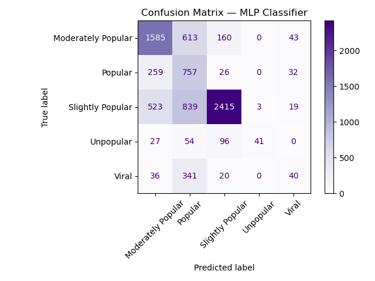

| Class               | Precision | Recall | F1-score | Support |
|---------------------|-----------|--------|----------|---------|
| Moderately Popular  | 0.62      | 0.73   | 0.67     | 2401    |
| Popular             | 0.38      | 0.64   | 0.48     | 1074    |
| Slightly Popular    | 0.88      | 0.68   | 0.77     | 3799    |
| Unpopular           | 0.65      | 0.22   | 0.33     | 218     |
| Viral               | 0.17      | 0.13   | 0.15     | 437     |

Un model MLP (Multi-Layer Perceptron) a fost antrenat folosind biblioteca scikit-learn pentru a prezice categoria de popularitate a articolelor de știri (popularity_category). Modelul a fost antrenat pe datele procesate (X_train, y_train) și a utilizat următorii hiperparametri:
Arhitectura:
- Straturi ascunse (hidden_layer_sizes): două straturi ascunse cu 256 și 128 de neuroni;
- Funcție de activare (activation): relu, aleasă pentru eficiența sa în propagarea gradientului și învățarea non-liniară.
Optimizare:
- Algoritm (solver): adam, optimizator eficient pentru date mari și sparse;
- Rată de învățare (learning_rate_init): 0.001 — valoare implicită adecvată pentru stabilitate;
- Număr maxim de epoci (max_iter): 3000 — permite rețelei suficiente cicluri de antrenament pentru convergență.
Regularizare:
- Early stopping: activat (early_stopping=True) — antrenarea se oprește când performanța de validare nu mai crește;
- Regularizare L2 (alpha): 0.0001 — previne suprapotrivirea penalizând ponderile mari.

Modelul a obținut o acuratețe generală de 64.48%, cu următoarele observații importante extrase din matricea de confuzie:
- Slightly Popular și Moderately Popular sunt cel mai bine clasificate (f1-scores de 0.77 și 0.67), fiind și cele mai frecvente clase;
- Popular are o performanță decentă (f1 ≈ 0.48), dar confuziile sunt frecvente cu Moderately Popular;
- Clasele Unpopular și Viral sunt slab clasificate (f1 ≈ 0.15–0.33), cu numeroase confuzii către Popular și Slightly Popular.
- Modelul tinde să favorizeze clasele dominante și are dificultăți în a învăța reprezentări clare pentru clasele rare. De asemenea, observăm că Viral este frecvent confundată cu Popular, iar Unpopular este distribuită între mai multe clase.

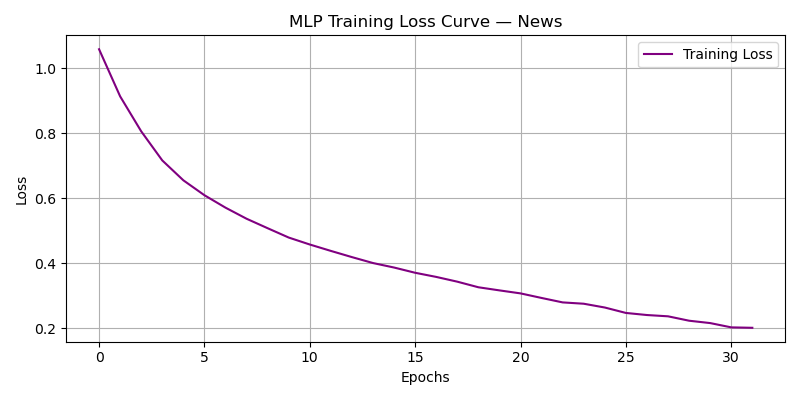

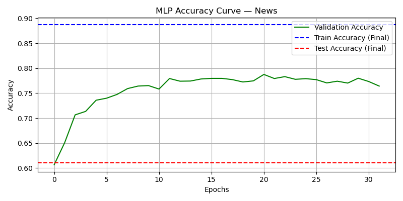

## Comparatie
| Method | Accuracy-AIR | Accuracy-NEWS |
|--------|--------------|----------------|
| dt     | 0.8886       | 0.8135         |
| rf     | 0.9111       | 0.8135         |
| lr     | 0.6953       | 0.4780         |
| mlp    | 0.9704       | 0.6102         |
